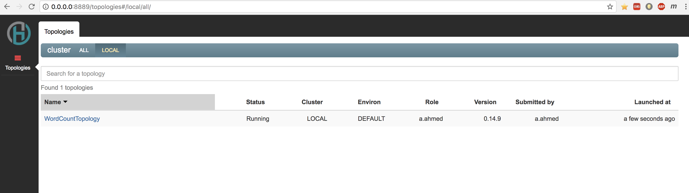

# Create an Heron topology in Python

Here we create a Heron topology that implements a word-count application. We will use pants to build and package the project.

## Prerequisites

* [Python 2.7](https://www.python.org/download/releases/2.7/) The python language and interpreter. **Note:**  Currently heron does not support python 3

* [Pip](https://pip.pypa.io/en/stable/installing/) The python 2 package manager.

* [Pants](http://www.pantsbuild.org/): Pants is a project build system for multiple languages including python.

* A text editor or IDE.


## Clone the project

From the command line, use the following git command to clone this project

```bash
git clone https://github.com/streamlio/heron-python-tutorial.git
```

This command creates a directory named `heron-python-tutorial` at the current location, which contains a basic heron python project.
The `heron-python-tutorial` directory contains the following items:

* `3rdparty`: Contains the reference links to 3rd party python libraries.
* `pants.ini`: Contains the pants version information.
* `pants`: The pants executable which can bootstrap the setup of pants also.
* `src`: Contains the build definition and source artifacts for the topology.


## Understating the pants build definition files


### 3rd party dependencies

3rd party libraries which are referenced in the main project are put under the folder `3rdparty/python` with a `BUILD` file specifying the type of libraries 

```bash
python_requirements()
```

and a `requirements.txt` file specifying the libraries in out case `heronpy` and `six` with there respective target version numbers

```bash
heronpy==0.15.0
six==1.10.0
```

### Topology Build file

The file to build the main topology bundle is the `BUILD` file under `src/python/word-count-topology` it's as below.

```python
python_library(
    name = "spouts-bolts-py",
    sources=globs('*.py', exclude=[['word_count_topology.py']]),
)

python_binary(
    name = "word-count-topology",
    source='word_count_topology.py',
    dependencies = [
        ':spouts-bolts-py',
        '3rdparty/python:heronpy',
        '3rdparty/python:six',
    ],
)
```

In the example above the python libraries bundles all the custom defined spouts and bolts in a local package called spouts-bolts-py excluding the
`word_count_topology.py` which is the bootstrap code and the topology builder.

the `python_binary` builds the bundle with an entry point , we provide a name and source of the entry point and the dependencies, in our case the
generated `spouts-bolts-py` bundle and the 3rd party dependencies


### Pants python details

More details on pants usage for python can be found here
[https://pantsbuild.github.io/python-readme.html]([https://pantsbuild.github.io/python-readme.html])


## Topology details

This Python based Heron topology consists of three components that you must author (or reference) as a dependency.

* **Spouts**: Reads data from external sources and emits streams of data into the topology.

* **Bolts**: Performs processing on streams emitted by spouts or other bolts, and emits one or more streams.

* **Topology**: Defines how the spouts and bolts are arranged, and provides the entry point for the topology.

### Create the spout

First, we need to create a data [*spout*](https://twitter.github.io/heron/docs/concepts/topologies/#spouts) for our topology that produces data to be processed.

> Spouts can ingest data from all kinds of sources, from "Big Data" systems like [Apache Spark](https://spark.apache.org/) to pub-sub messaging systems like [Apache Kafka](https://kafka.apache.org) and [Apache Pulsar](https://pulsar.incubator.apache.org). We'll keep it simple here and build a self-generating stream of data.

The random sentence spout is implemented in [`random_sentence_spout.py`](src/python/word-count-topology/random_sentence_spout.py):

```python
from time import sleep
import random

# Import spout type from heronpy
from heronpy import Spout

# Helper method to provide continuous random iteration of a list of times
def random_cycle(ls):
    local_ls = ls[:] # Local defensive copy
    while True:
        random.shuffle(local_ls)
        for e in local_ls:
            yield e

# Random sentence generator Spout class that inherits from heron Spout
class RandomSentenceSpout(Spout):

    # Important : Define output field tags for the Spout
    outputs = ['sentence']

    # Spout initialization
    def initialize(self, config, context):
        # A log context is provided in the context of the spout
        self.log("Initializing Random Sentence Spout...")

        # A collection of sentences to random iterate over
        self.sentences = random_cycle([
            "the cow jumped over the moon",
            "an apple a day keeps the doctor away",
            "four score and seven years ago",
            "snow white and the seven dwarfs",
            "i am at two with nature"
        ])

    # Generate next tuple sequence for this spout
    def next_tuple(self):
        sleep(0.05) # Sleep for 50 ms to throttle Spout
        sentence = next(self.sentences) # Get next random sentence
        self.emit([sentence]) # Emit Sentence to go to next phase in the topology

```

> [!NOTE]
> Although this topology uses only one spout, others may have several that feed data from different sources into the topology.

### Create the bolts

[*Bolts*](https://twitter.github.io/heron/docs/concepts/topologies/#bolts) handle data processing in Heron topologies. Bolts can do essentially anything you want them to, including performing computations, writing values to databases, publishing messages to pub-sub systems, and more.

Our word count topology uses two bolts:

* The `split_sentence_bolt.py` splits the sentences emitted by the `rando_sentence_spout` into individual words

* The `word_count_bolt` receives groups of words from the `split_sentence_bolt` and counts how many times each word has occurred

These bolts are implemented in [`split_sentence_bolt.py`](src/main/python/tutorial/split_sentence_bolt.py) and [`word_count_bolt.py`](src/main/python/tutorial/word_count_bolt.py). You can check out the code by following those links or read more below.

#### split\_sentence\_bolt

```python
# Import Bolt type from heronpy
from heronpy import Bolt

# Sentence Splitting Bolt class that inherits from heron Bolt
class SplitSentenceBolt(Bolt):

    # Important : Define output field tags for the Bolt
    outputs = ['word']

    def initialize(self, config, context):
        # A log context is provided in the context of the spout
        self.log("Initializing SplitSentenceBolt...")

    # Process incoming tuple and emit output
    def process(self, tup):
        # Accept a sentence string and spit into words via space delimiter
        for word in tup.values[0].split(" "):
            # Emit individual words to next phase of the topology
            self.emit([word])

```

#### word\_count\_bolt

```python
from collections import Counter

# Import Bolt type from heronpy
from heronpy import Bolt

# Word Count Bolt that inherits from heron Bolt
class WordCountBolt(Bolt):

    # Important : Define output field tags for the Bolt
    outputs = ['word', 'count']

    def initialize(self, config, context):
        # A log context is provided in the context of the spout
        self.log("Initializing WordCountBolt...")
        # We initialize a python collections Counter for recording hte word count
        self.counter = Counter()

    # Process Periodic tick tuple to log and emit output
    def process_tick(self, tup):
        # If tuple type is tick type a special periodic interval entry generate logs and emit sequence
        for value, count in self.counter.most_common():
            self.log("Emitting a count of ({}) for word ({})".format(value, count))
            self.emit([value, count])

    # Process Word stream to aggregate to word count
    def process(self, tup):
        word = tup.values[0]
        self.counter[word] += 1

```

### Define the topology

Once you've created the spouts and bolts that you need for your use case, you need to tie everything together into a processing graph known as a topology (technically speaking a *directed acyclic graph*). Topologies define how data flows between the components. The topology level is also where you can provide *parallelism hints* that Heron can use to make hardware and other choices when creating instances of the components within the cluster.

The following image is a basic diagram of the graph of components for our word count topology:

```
+----------------+          +-------------------+             +-------------+      ("A",2)
|                |          |                   |             |             |
|random_sentence |          |                   |             |             |      ("B",1)
|    _spout      +---------->  split_sentence   +------------>+  word_count +---->
|                |          |       _bolt       |             |    _bolt    |      ("C",1)
|                |          |                   |             |             |
+----------------+          +-------------------+   ("A")     +-------------+      ("D",2)
                                                    ("D")
         ("A D B C A D")                            ("B")
                                                    ("C")
                                                    ("A")
                                                    ("D")

```


The word count topology is implemented in [`word_count_topology.py`](src/python/word_count_topology.py). You can see the code by following that link or below:

```python
# Import Grouping and TopologyBuilder from heronpy
from heronpy import Grouping, TopologyBuilder

# Import the defined Bolts and Spouts
from split_sentence_bolt import SplitSentenceBolt
from word_count_bolt import WordCountBolt
from random_sentence_spout import RandomSentenceSpout
import heron.api.src.python.api_constants as constants

if __name__ == '__main__':
    # Define the topology name
    builder = TopologyBuilder("Word_Count_Topology")

    # Define the topology dag

    # Start with the random sentence generator, create a reference and define a parallelism hint with par attribute
    random_sentence_bolt = builder.add_spout("random_sentence_spout", RandomSentenceSpout, par=1)

    # Link the output of the random sentence generator to the split sentence bolt, the input grouping is
    # done on the field `sentence`
    split_sentence_bolt_inputs = {
        random_sentence_bolt: Grouping.fields('sentence')
    }
    # Define the split sentence bolt with the input context defined above and a parallelism hint.
    split_sentence_bolt = builder.add_bolt("split_sentence_bolt", SplitSentenceBolt, par=2,
                                           inputs=split_sentence_bolt_inputs)

    # Link the output of the split sentence bolt to the word count bolt, the input grouping is
    # done on the field `word`
    word_count_bolt_inputs = {
        split_sentence_bolt: Grouping.fields('word')
    }

    # Define emit frequency in seconds, this is used throttle word_count_bolt, log and emit output frequency
    emit_frequency = 3;

    config = {
        constants.TOPOLOGY_TICK_TUPLE_FREQ_SECS: emit_frequency
    }

    # Define the word count bolt with the input context defined above and a parallelism hint and emit frequency config
    # and
    word_count_bolt = builder.add_bolt("word_count_bolt", WordCountBolt, par=2,
                                       inputs=word_count_bolt_inputs, config=config)

    # Finalize the topology graph
    builder.build_and_submit()

```

### logging

Heron python spouts and bolts have an attribute log which can be accessed by `self.log()` inside classes extending from `Bolt` or `Spout` base classes for logging purposes.


## Test on the cluster

In order to test our topology, we need to build a [.pex](https://pex.readthedocs.io/en/stable/whatispex.html) archive which is a python package format, that we can deploy on a running Heron cluster. For our example we'll assume that you've set up a single-node Heron cluster running locally. Follow [this simple tutorial](https://twitter.github.io/heron/docs/getting-started/) to get a Heron cluster running in just a few commands.

Once the cluster is up and running, you can package the topology using the configuration that's already in `pom.xml` and then submit the topology to the Heron cluster:

```shell
$ ./pants binary src/python/word-count-topology
```

__Note:__ First time invocation of pants binary might instantiate a bootstrap if pants has not been setup on the machine before. 

$ heron submit local \
  ./dist/word-count-topology.pex \
  - \
  Word_Count_Topology \
  --deploy-deactivated
```

### Command explanation

There was a lot going on in that last command. We'll break it down a bit here:

```shell
$ ./pants binary src/python/word-count-topology # This will build the pex with all the python its dependencies bundled

$ heron submit local \ # Submit to the local cluster
  ./dist/word-count-topology.pex \ # The path of the topology's pex file
  - \ # No Class definition as this is a python package
  WordCountTopology \ # The name of the topology (must be unique in a cluster)
  --deploy-deactivated # Deploy in deactivated mode
```

### Activating the topology

At this point, the topology has been *submitted* to the Heron cluster but not yet *activated*. That essentially means that Heron has your application code and knows how to run it but hasn't actually started any processes yet. To activate---or run---the topology:

```shell
$ heron activate local Word_Count_Topology
```

### Visually examining cluster execution

To interact with our word count topology visually, we can use a dashboard interface called Heron UI. To see how to start up Heron UI, see step 4 in [this tutorial](https://twitter.github.io/heron/docs/getting-started/). Once you've started up the UI you can navigate to http://localhost:8889 and see the word count topology running. It should look like this:



We can now examine the topology by clicking on it:


Clicking on the count bolt will open further details:


We can click on the view button > logs on the count bolt to show the streaming stdout:


### Deactivating the topology

Once you've gone through this tutorial, you can deactivate and kill the topology:

```shell
$ heron deactivate local WordCountTopology
$ heron kill local WordCountTopology 
```

> Deactivating a topology means that the topology is still known to the cluster but not running; killing the topology deletes it from the cluster for good.

 